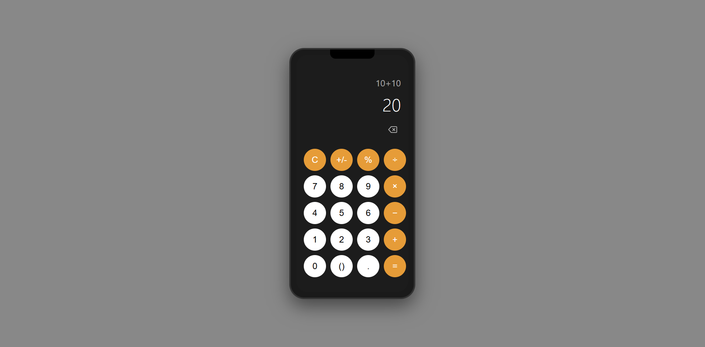

# 📱 Phone Calculator Mockup

A web-based calculator designed to look and feel like a mobile phone calculator.

## 🚀 Features

- **Mobile-First Design**: Mimics a smartphone calculator, complete with notch and status bar.
- **Basic Arithmetic**: Addition, subtraction, multiplication, and division.
- **Live Display**: Shows current expression and result.
- **Responsive Layout**: Works on desktop and mobile screens.

## 🛠️ Technologies

- HTML5
- CSS3
- JavaScript

## 📂 File Structure

- `index.html` — Main HTML file
- `style.css` — Styles for the calculator and phone mockup
- `script.js` — Calculator logic and interactivity

## 🖥️ Installation & Usage

1. Download or clone this repository.
2. Open `index.html` in your web browser.
3. Use the on-screen keypad to perform calculations.

## ✨ Screenshots

>  <!-- Add screenshot.png if available -->

## 📄 License

This project is open source and free to use.

## 🙏 Credits

Created by Glenn Mark, December 2025.

